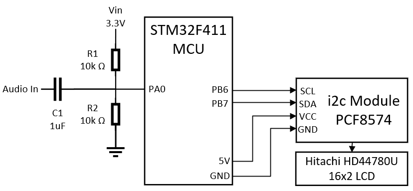

# Real Time Audio Spectrum Analyzer

Chosen Class Project for ECE 692 - Embedded Computing Systems

The goal of this project was to develop a device that would show the frequency domain spectrum of a sampled audio signal on a 16x2 LCD.

The Spectrum samples the signal 256 times at a sampling frequency of ~16kHz, so the spectrum is shows the range 0Hz to ~8kHz using 16 bands. There is no circuitry that filters frequencies above 8kHz, aliasing will occur and there is nothing is stop it beware! The large majority of music stays within 0Hz to 10kHz depending on what you are listening to. Looking at audio frequency charts we can see there is more precision for lower frequencies (bass) and less precision as we climb up to midrage and eventually high range.

## Basic Operation:

## Schematic:

## Pin Assignments:

PA0 - ADC1

PB6 - I2C1 SCL
 
PB7 - I2C1 SDA

## Personal Accomplishments:

* Successfully built an Audio Spectrum Analyzer
* Everything in this project is bare metal, no libraries or external functions used (fix_fft.c FFT function only exception)
* Successfully configured all peripherals: GPIO, ADC, I2C
* Built a custom driver for Hitachi LCD with i2c module from scratch, can be reused for other projects
* Built a circuit that would amplify audio voltage to a readable ADC value

## Things to Improve Upon:

* Build a proper amplifier circuit, Common Collector Amplifier for example
* Create my own FFT algorithm function
* Aliasing is an issue, any frequencies above 8kHz will be sampled wrong, build a low pass filter to filter any unwanted high frequencies
* Have more bands dedicated to bass (0Hz - 300Hz), less for midrange (300Hz - 5kHz), even less for highrange (5kHz - 20kHz)
